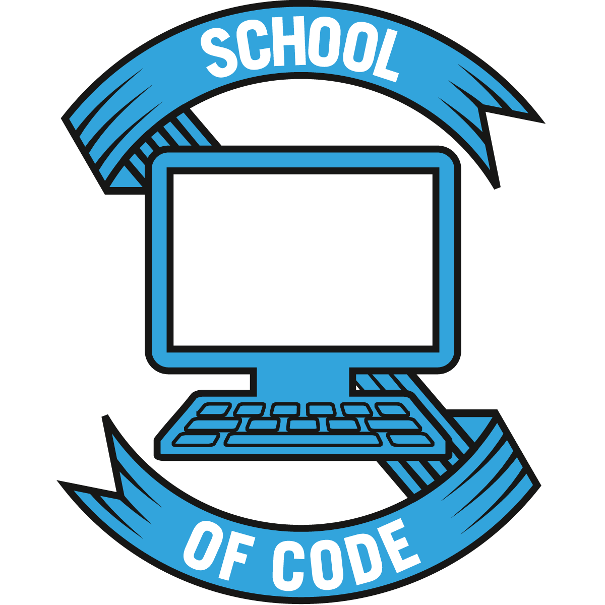

<a href="https://socbrain.vercel.app/">
  
  <h1 align="center">SoCBrain</h1>
</a>

<h4 align="center">
 The School of Code quiz and progress tracking app built by Algorhythm.   
 For information on how to use functions within the app, please use <a href="https://www.notion.so/algorhythmdocs/SoCBrain-Docs-1c9124260da64589ad52303490438d79">SoCBrain Docs</a>.
</h4>

## How To

- The deployed site is live at https://socbrain.vercel.app/. All bootcampers should be directed here and should not be given access to this repository.
- If you are looking to use the development environment:
  - Clone down this repo to your local machine.
  - Use `npm install`.
  - Create a .env file and input the `NEXT_PUBLIC_SUPABASE_URL` and `NEXT_PUBLIC_SUPABASE_ANON_KEY` which will have been provided if you have authorisation to use this repository.  If you believe you should have access, but do not have these credentials, please contact the team at Algorhythm to discuss.
  - Use `npm run dev` to see your local changes.
- Any git pushes will reflect in the deployment environment through the Continuous Deployment phase of this project via Vercel.

## Algorhythm

Algorhythm is a School of Code team who came together in the final four weeks of their bootcamp to plan, build and deploy a solution to a unique problem posed by their stakeholder, who in this case turned out to be the School of Code themselves.  

After learning that the current learning management system was not nearly up to scratch, a solution had to be found, and the idea for SoCBrain was founded. It would be able to enhance the learning experience for all future bootcampers whilst simultaneously giving easy access to tracking metrics for the coaches to be able to tailor individual learning plans better for their students.    

This fantastic team was made up by the following developers:

- Jack White
- Annamaria Koutsoras
- Igor Silva
- Callum Basnett
- Stephen Boyce
- Livia Genevieve Busseni

